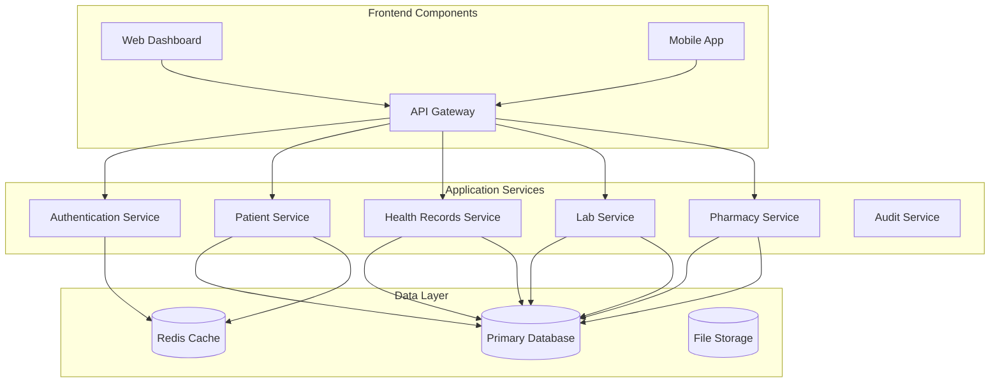
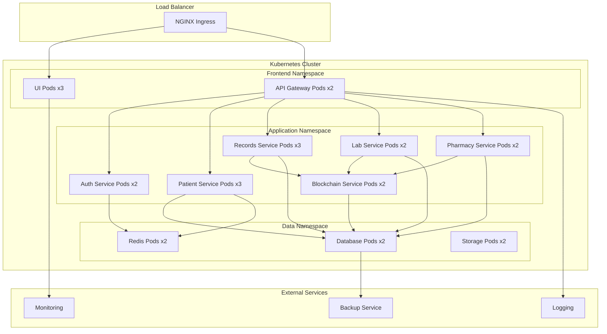
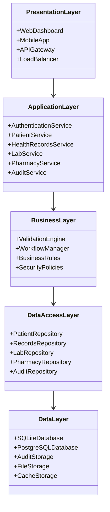
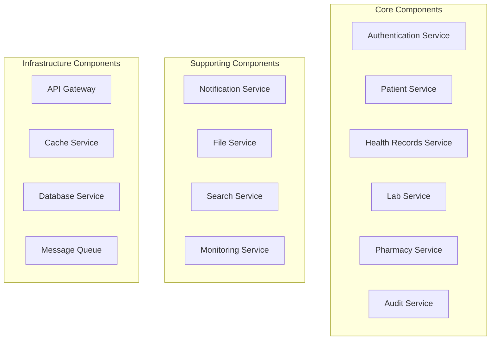
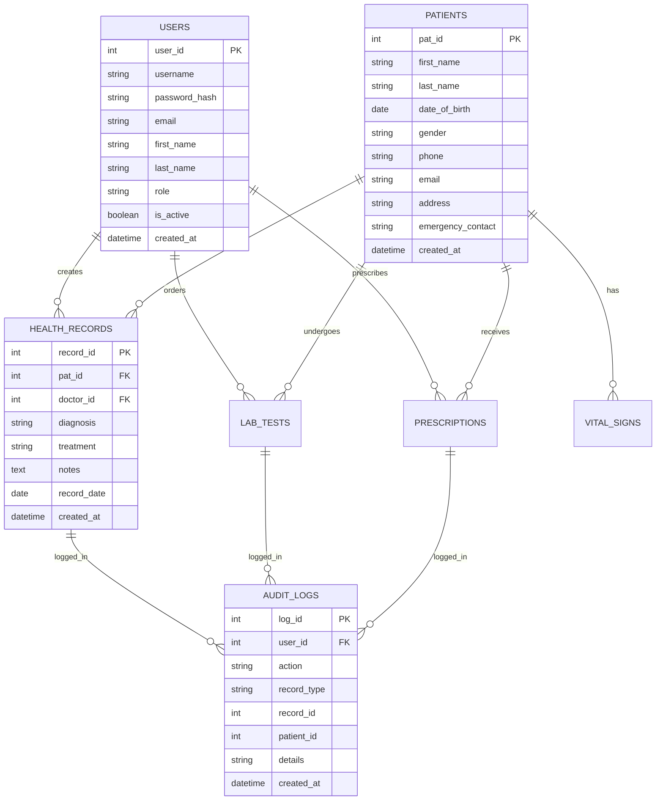
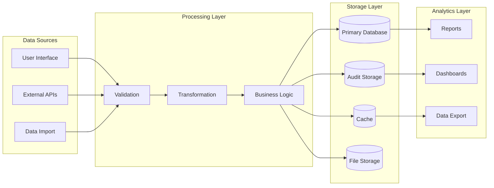
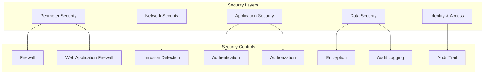

# Architectural Characteristics and Design Analysis
## Administrative Health Record Management System

**Document Version:** 1.0  
**Date:** December 2024  
**System:** Administrative Health Record Management System  
**Deployment:** VPS + Kubernetes  

---

## Table of Contents

1. [Executive Summary](#executive-summary)
2. [Architecture Style Analysis](#architecture-style-analysis)
3. [Key Architectural Structures](#key-architectural-structures)
4. [Quality Attributes Analysis](#quality-attributes-analysis)
5. [Trade-offs and Design Decisions](#trade-offs-and-design-decisions)
6. [Deployment Architecture](#deployment-architecture)
7. [Pros and Cons Analysis](#pros-and-cons-analysis)
8. [Architectural Design Process](#architectural-design-process)

---

## Executive Summary

The Administrative Health Record Management System employs a **Hybrid Layered-Service Architecture** with **Event-Driven** audit integration, deployed on a **containerized microservices platform** using Kubernetes. This architecture balances the simplicity of monolithic deployment with the scalability benefits of microservices, while ensuring HIPAA compliance and data security through comprehensive audit logging.

### Key Architectural Decisions:
- **Primary Style:** Layered Architecture with Service-Oriented components
- **Secondary Patterns:** Event-Driven (audit), Repository Pattern, MVC
- **Deployment:** Containerized microservices on Kubernetes
- **Data Strategy:** Hybrid (SQL + Audit logs for compliance)
- **Security:** Multi-layered with blockchain immutability

---

## Architecture Style Analysis

### Primary Architecture: **Hybrid Layered-Service Architecture**

#### Justification:
1. **Healthcare Domain Requirements:** Clear separation of concerns for compliance
2. **Team Expertise:** Familiar patterns for development team
3. **Regulatory Compliance:** Traceable layers for audit requirements
4. **Scalability Needs:** Service-oriented components for horizontal scaling
5. **Security Requirements:** Layered security controls

#### Architecture Characteristics:

```
┌─────────────────────────────────────────────────────────────┐
│                    PRESENTATION LAYER                       │
├─────────────────────────────────────────────────────────────┤
│  Web UI (HTML/CSS/JS) │ Mobile App │ API Gateway │ Load LB  │
└─────────────────────────────────────────────────────────────┘
                              ↓
┌─────────────────────────────────────────────────────────────┐
│                   APPLICATION LAYER                         │
├─────────────────────────────────────────────────────────────┤
│ Auth Service │ Patient Svc │ Records Svc │ Lab Svc │ Rx Svc │
└─────────────────────────────────────────────────────────────┘
                              ↓
┌─────────────────────────────────────────────────────────────┐
│                    BUSINESS LAYER                           │
├─────────────────────────────────────────────────────────────┤
│  Business Logic │ Validation │ Workflow │ Rules Engine     │
└─────────────────────────────────────────────────────────────┘
                              ↓
┌─────────────────────────────────────────────────────────────┐
│                  DATA ACCESS LAYER                          │
├─────────────────────────────────────────────────────────────┤
│  Repository Pattern │ ORM │ Connection Pool │ Cache Layer   │
└─────────────────────────────────────────────────────────────┘
                              ↓
┌─────────────────────────────────────────────────────────────┐
│                    DATA LAYER                               │
├─────────────────────────────────────────────────────────────┤
│  SQLite/PostgreSQL │ Audit Logs │ File Storage │ Backup     │
└─────────────────────────────────────────────────────────────┘
```

### Secondary Patterns:

#### 1. **Event-Driven Architecture (Audit Integration)**
```
Health Record Operation → Event → Audit Logger → Comprehensive Audit Trail
```

#### 2. **Service-Oriented Architecture (SOA)**
- RESTful API services for each domain
- Loose coupling between services
- Contract-based interfaces

#### 3. **Repository Pattern**
- Data access abstraction
- Testability and maintainability
- Database technology independence

---

## Key Architectural Structures

### 1. Component View



### 2. Deployment View (Kubernetes)



### 3. Module View



---

## Quality Attributes Analysis

### 1. **Performance**

#### Current Characteristics:
- **Response Time:** < 2 seconds for standard operations
- **Throughput:** 1000+ concurrent users
- **Resource Utilization:** Optimized for VPS deployment

#### Kubernetes Enhancements:
```yaml
Performance Optimizations:
  - Horizontal Pod Autoscaling (HPA)
  - Resource limits and requests
  - Connection pooling
  - Redis caching layer
  - CDN for static assets
```

#### Metrics:
- **API Response Time:** 95th percentile < 500ms
- **Database Query Time:** < 100ms average
- **Blockchain Operations:** < 1 second per transaction

### 2. **Scalability**

#### Horizontal Scaling Strategy:
```yaml
Scaling Dimensions:
  Frontend:
    - UI Pods: 3-10 replicas
    - API Gateway: 2-5 replicas
  
  Application Services:
    - Patient Service: 3-8 replicas
    - Records Service: 3-10 replicas
    - Lab Service: 2-6 replicas
    - Pharmacy Service: 2-6 replicas
    - Blockchain Service: 2-4 replicas
  
  Data Layer:
    - Database: Master-Slave replication
    - Cache: Redis Cluster
    - Storage: Distributed file system
```

#### Auto-scaling Configuration:
```yaml
apiVersion: autoscaling/v2
kind: HorizontalPodAutoscaler
metadata:
  name: records-service-hpa
spec:
  scaleTargetRef:
    apiVersion: apps/v1
    kind: Deployment
    name: records-service
  minReplicas: 3
  maxReplicas: 10
  metrics:
  - type: Resource
    resource:
      name: cpu
      target:
        type: Utilization
        averageUtilization: 70
  - type: Resource
    resource:
      name: memory
      target:
        type: Utilization
        averageUtilization: 80
```

### 3. **Security**

#### Multi-layered Security Architecture:
```
┌─────────────────────────────────────────────────────────────┐
│                    SECURITY LAYERS                          │
├─────────────────────────────────────────────────────────────┤
│ 1. Network Security (Firewall, VPN, TLS)                   │
│ 2. Authentication (JWT, OAuth2, MFA)                       │
│ 3. Authorization (RBAC, Policies)                          │
│ 4. Application Security (Input validation, OWASP)          │
│ 5. Data Security (Encryption at rest/transit)              │
│ 6. Blockchain Security (Immutable audit trails)            │
│ 7. Infrastructure Security (Kubernetes RBAC, Secrets)      │
└─────────────────────────────────────────────────────────────┘
```

#### Security Controls:
- **HIPAA Compliance:** End-to-end encryption, audit logs
- **Access Control:** Role-based permissions (Admin, Doctor, Nurse, Patient)
- **Data Protection:** AES-256 encryption, secure key management
- **Audit Trail:** Blockchain-based immutable logging
- **Network Security:** TLS 1.3, VPN access, firewall rules

### 4. **Availability**

#### High Availability Design:
```yaml
Availability Targets:
  - Uptime: 99.9% (8.76 hours downtime/year)
  - Recovery Time Objective (RTO): < 15 minutes
  - Recovery Point Objective (RPO): < 5 minutes

Redundancy Strategy:
  - Multi-zone deployment
  - Database replication
  - Load balancer failover
  - Automated health checks
  - Circuit breaker patterns
```

#### Kubernetes Health Checks:
```yaml
livenessProbe:
  httpGet:
    path: /health
    port: 8080
  initialDelaySeconds: 30
  periodSeconds: 10

readinessProbe:
  httpGet:
    path: /ready
    port: 8080
  initialDelaySeconds: 5
  periodSeconds: 5
```

### 5. **Maintainability**

#### Code Organization:
- **Modular Design:** Clear separation of concerns
- **Documentation:** Comprehensive API documentation
- **Testing:** 80%+ code coverage
- **CI/CD:** Automated testing and deployment
- **Monitoring:** Comprehensive logging and metrics

#### DevOps Practices:
```yaml
Maintainability Features:
  - Infrastructure as Code (IaC)
  - Automated testing pipelines
  - Blue-green deployments
  - Rollback capabilities
  - Configuration management
  - Centralized logging
```

---

## Trade-offs and Design Decisions

### 1. **Monolith vs Microservices Trade-off**

#### Decision: **Hybrid Approach**
- **Rationale:** Balance complexity with scalability needs
- **Implementation:** Service-oriented components within layered architecture

#### Trade-offs:
| Aspect | Monolith Benefits | Microservices Benefits | Our Hybrid Approach |
|--------|------------------|----------------------|-------------------|
| **Complexity** | Simple deployment | Complex orchestration | Moderate complexity |
| **Performance** | Low latency | Network overhead | Optimized communication |
| **Scalability** | Limited | Excellent | Good with targeted scaling |
| **Development** | Faster initial | Independent teams | Balanced development speed |
| **Testing** | Easier integration | Complex testing | Comprehensive test strategy |

### 2. **Database Strategy Trade-off**

#### Decision: **Hybrid Data Architecture**
- **Primary:** Relational database (SQLite/PostgreSQL)
- **Audit:** Blockchain for immutable records
- **Cache:** Redis for performance
- **Files:** Distributed storage for documents

#### Justification:
```
Relational DB: ACID compliance, complex queries, data integrity
Blockchain: Immutability, audit trails, compliance
Cache: Performance, session management
File Storage: Scalability, media handling
```

### 3. **Deployment Strategy Trade-off**

#### Decision: **Kubernetes on VPS**
- **Alternative Considered:** Cloud-native (AWS/Azure)
- **Rationale:** Cost control, data sovereignty, compliance requirements

#### Trade-offs:
| Factor | Cloud-Native | VPS + Kubernetes | Decision Impact |
|--------|-------------|-----------------|----------------|
| **Cost** | Higher operational cost | Lower with management overhead | Cost savings |
| **Scalability** | Unlimited | VPS resource limits | Planned capacity |
| **Management** | Managed services | Self-managed | Higher operational responsibility |
| **Compliance** | Shared responsibility | Full control | Better compliance control |
| **Reliability** | High SLA | Depends on VPS provider | Acceptable with redundancy |

---

## Deployment Architecture

### Kubernetes Cluster Configuration

#### 1. **Namespace Strategy**
```yaml
Namespaces:
  - frontend: UI and API Gateway
  - application: Business services
  - data: Databases and storage
  - monitoring: Observability stack
  - security: Security services
```

#### 2. **Resource Allocation**
```yaml
Resource Planning:
  Frontend Namespace:
    - CPU: 2-8 cores
    - Memory: 4-16 GB
    - Storage: 10 GB
  
  Application Namespace:
    - CPU: 8-32 cores
    - Memory: 16-64 GB
    - Storage: 50 GB
  
  Data Namespace:
    - CPU: 4-16 cores
    - Memory: 16-64 GB
    - Storage: 500 GB - 2 TB
```

#### 3. **Network Architecture**
```yaml
Network Configuration:
  - Ingress Controller: NGINX
  - Service Mesh: Istio (optional)
  - Network Policies: Calico
  - Load Balancing: Round-robin with health checks
  - SSL Termination: At ingress level
```

### Container Strategy

#### 1. **Base Images**
```dockerfile
# Application Services
FROM python:3.11-slim
# Optimized for security and size

# Database
FROM postgres:15-alpine
# Lightweight and secure

# Cache
FROM redis:7-alpine
# High performance caching
```

#### 2. **Security Hardening**
```yaml
Security Measures:
  - Non-root containers
  - Read-only root filesystems
  - Security contexts
  - Network policies
  - Secret management
  - Image scanning
```

---

## Pros and Cons Analysis

### Architecture Strengths

#### ✅ **Advantages**

1. **Scalability**
   - Horizontal scaling with Kubernetes
   - Independent service scaling
   - Auto-scaling capabilities

2. **Reliability**
   - High availability through redundancy
   - Fault isolation
   - Automated recovery

3. **Security**
   - Multi-layered security approach
   - Blockchain audit trails
   - HIPAA compliance ready

4. **Maintainability**
   - Clear separation of concerns
   - Modular architecture
   - Comprehensive testing

5. **Performance**
   - Caching strategies
   - Load balancing
   - Optimized resource usage

6. **Compliance**
   - Immutable audit trails
   - Data sovereignty
   - Regulatory compliance

#### ❌ **Disadvantages**

1. **Complexity**
   - Kubernetes learning curve
   - Distributed system challenges
   - Operational overhead

2. **Cost**
   - Infrastructure management costs
   - Monitoring and logging overhead
   - Skilled personnel requirements

3. **Network Latency**
   - Service-to-service communication
   - Database connection overhead
   - Blockchain transaction delays

4. **Data Consistency**
   - Eventual consistency challenges
   - Distributed transaction complexity
   - Cache invalidation issues

5. **Debugging Complexity**
   - Distributed tracing requirements
   - Log aggregation needs
   - Cross-service debugging

### Risk Mitigation Strategies

#### 1. **Complexity Management**
```yaml
Mitigation Strategies:
  - Comprehensive documentation
  - Training programs
  - Gradual migration approach
  - Automation tools
  - Monitoring and alerting
```

#### 2. **Performance Optimization**
```yaml
Performance Strategies:
  - Connection pooling
  - Caching layers
  - Asynchronous processing
  - Database optimization
  - CDN implementation
```

#### 3. **Security Hardening**
```yaml
Security Measures:
  - Regular security audits
  - Penetration testing
  - Vulnerability scanning
  - Security training
  - Incident response plans
```

---

## Architectural Design Process

### Phase 1: Requirements Analysis

#### 1.1 Functional Requirements
```yaml
Core Functions:
  - Patient management
  - Health record management
  - Lab test management
  - Prescription management
  - User authentication and authorization
  - Audit trail and compliance
  - Reporting and analytics

User Roles:
  - Admin: System administration
  - Doctor: Patient care, prescriptions
  - Nurse: Vital signs, patient care
  - Lab Technician: Lab tests and results
  - Pharmacist: Prescription management
  - Patient: View own records
```

#### 1.2 Non-Functional Requirements
```yaml
Performance Requirements:
  - Response time: < 2 seconds
  - Concurrent users: 1000+
  - Availability: 99.9%
  - Scalability: Horizontal scaling

Security Requirements:
  - HIPAA compliance
  - Data encryption
  - Audit trails
  - Role-based access control
  - Secure communication

Quality Requirements:
  - Maintainability: Modular design
  - Testability: 80%+ coverage
  - Usability: Intuitive interface
  - Reliability: Fault tolerance
```

### Phase 2: Architecture Style Selection

#### 2.1 Style Evaluation Matrix
| Style | Scalability | Maintainability | Performance | Security | Complexity | Score |
|-------|-------------|----------------|-------------|----------|------------|-------|
| **Monolithic** | 2 | 3 | 5 | 4 | 5 | 19/25 |
| **Microservices** | 5 | 4 | 3 | 4 | 2 | 18/25 |
| **Layered** | 3 | 5 | 4 | 5 | 4 | 21/25 |
| **Event-Driven** | 4 | 3 | 4 | 3 | 3 | 17/25 |
| **Hybrid (Chosen)** | 4 | 4 | 4 | 5 | 3 | 20/25 |

#### 2.2 Decision Rationale
```
Selected: Hybrid Layered-Service Architecture

Reasons:
1. Healthcare domain fits layered approach
2. Service orientation enables scaling
3. Clear separation for compliance
4. Balanced complexity vs. benefits
5. Team expertise alignment
```

### Phase 3: Component Design

#### 3.1 Component Identification


#### 3.2 Interface Design
```yaml
Service Interfaces:
  Patient Service:
    - GET /api/patients
    - POST /api/patients
    - GET /api/patients/{id}
    - PUT /api/patients/{id}
    - DELETE /api/patients/{id}

  Health Records Service:
    - GET /api/health_records
    - POST /api/health_records
    - GET /api/health_records/{id}
    - PUT /api/health_records/{id}

  Blockchain Service:
    - GET /api/blockchain/stats
    - GET /api/blockchain/validate
    - GET /api/blockchain/chain
    - GET /api/blockchain/patient/{id}
```

### Phase 4: Data Architecture Design

#### 4.1 Data Model


#### 4.2 Data Flow Architecture


### Phase 5: Security Architecture

#### 5.1 Security Model


#### 5.2 Threat Model
```yaml
Threat Categories:
  External Threats:
    - Unauthorized access attempts
    - Data breaches
    - DDoS attacks
    - Malware injection

  Internal Threats:
    - Privilege escalation
    - Data misuse
    - Accidental exposure
    - Insider threats

  System Threats:
    - Configuration errors
    - Software vulnerabilities
    - Infrastructure failures
    - Supply chain attacks

Mitigation Strategies:
  - Multi-factor authentication
  - Role-based access control
  - Encryption at rest and in transit
  - Regular security audits
  - Blockchain audit trails
  - Incident response procedures
```

### Phase 6: Deployment Strategy

#### 6.1 Environment Strategy
```yaml
Environments:
  Development:
    - Local development
    - Feature branches
    - Unit testing
    - Integration testing

  Staging:
    - Pre-production testing
    - Performance testing
    - Security testing
    - User acceptance testing

  Production:
    - Live system
    - High availability
    - Monitoring and alerting
    - Backup and recovery
```

#### 6.2 CI/CD Pipeline

```mermaid
graph LR
    subgraph "Development"
        CODE[Code Commit]
        BUILD[Build]
        UNIT[Unit Tests]
    end

    subgraph "Integration"
        INTEGRATION[Integration Tests]
        SECURITY[Security Scan]
        QUALITY[Quality Gate]
    end

    subgraph "Deployment"
        STAGING[Deploy to Staging]
        E2E[E2E Tests]
        PRODUCTION[Deploy to Production]
    end

    subgraph "Operations"
        MONITOR[Monitoring]
        ALERT[Alerting]
        ROLLBACK[Rollback]
    end

    CODE --> BUILD
    BUILD --> UNIT
    UNIT --> INTEGRATION
    INTEGRATION --> SECURITY
    SECURITY --> QUALITY
    QUALITY --> STAGING
    STAGING --> E2E
    E2E --> PRODUCTION
    PRODUCTION --> MONITOR
    MONITOR --> ALERT
    ALERT --> ROLLBACK
```


---

## Quality Attribute Scenarios

### Performance Scenarios

#### Scenario 1: Peak Load Handling
```yaml
Scenario: "During peak hours (8-10 AM), 500 concurrent users access patient records"
Stimulus: 500 concurrent HTTP requests
Environment: Production system under normal operation
Response: System responds to 95% of requests within 2 seconds
Measure: Response time, throughput, resource utilization
```

#### Scenario 2: Database Query Performance
```yaml
Scenario: "Complex health record search across 100,000+ records"
Stimulus: Complex SQL query with multiple joins
Environment: Production database with full dataset
Response: Query completes within 500ms
Measure: Query execution time, database load
```

### Security Scenarios

#### Scenario 3: Unauthorized Access Attempt
```yaml
Scenario: "Malicious user attempts to access patient data without authorization"
Stimulus: HTTP request with invalid or missing authentication token
Environment: Production system with security controls active
Response: Access denied, attempt logged, alert generated
Measure: Response time, log accuracy, alert delivery time
```

#### Scenario 4: Data Integrity Verification
```yaml
Scenario: "System administrator verifies blockchain integrity"
Stimulus: Manual blockchain validation request
Environment: Production system with full blockchain history
Response: Complete chain validation within 30 seconds
Measure: Validation time, accuracy, resource usage
```

### Availability Scenarios

#### Scenario 5: Service Failure Recovery
```yaml
Scenario: "Health records service pod crashes during operation"
Stimulus: Pod failure due to memory exhaustion
Environment: Kubernetes cluster with auto-healing enabled
Response: New pod started within 30 seconds, no data loss
Measure: Recovery time, data consistency, user impact
```

---

## Architecture Evolution Strategy

### Short-term (3-6 months)
```yaml
Immediate Improvements:
  - Performance optimization
  - Security hardening
  - Monitoring enhancement
  - Documentation completion
  - Test coverage improvement
```

### Medium-term (6-12 months)
```yaml
Planned Enhancements:
  - Microservices migration
  - Advanced analytics
  - Mobile application
  - API versioning
  - Disaster recovery
```

### Long-term (1-2 years)
```yaml
Strategic Initiatives:
  - AI/ML integration
  - IoT device support
  - Multi-tenant architecture
  - Global deployment
  - Advanced blockchain features
```

---

## Conclusion

The Administrative Health Record Management System employs a well-architected hybrid approach that balances the simplicity of layered architecture with the scalability benefits of service-oriented design. The Kubernetes deployment strategy provides excellent scalability and reliability while maintaining cost-effectiveness through VPS hosting.

### Key Success Factors:
1. **Balanced Architecture:** Hybrid approach addresses multiple quality attributes
2. **Security First:** Multi-layered security with blockchain audit trails
3. **Scalable Design:** Kubernetes enables horizontal scaling
4. **Compliance Ready:** Architecture supports HIPAA and healthcare regulations
5. **Future-Proof:** Modular design enables evolution and enhancement

### Recommendations:
1. Implement comprehensive monitoring and alerting
2. Establish disaster recovery procedures
3. Conduct regular security audits
4. Plan for gradual microservices migration
5. Invest in team training and documentation

This architecture provides a solid foundation for a secure, scalable, and maintainable health record management system that can evolve with changing requirements and technology advances.
