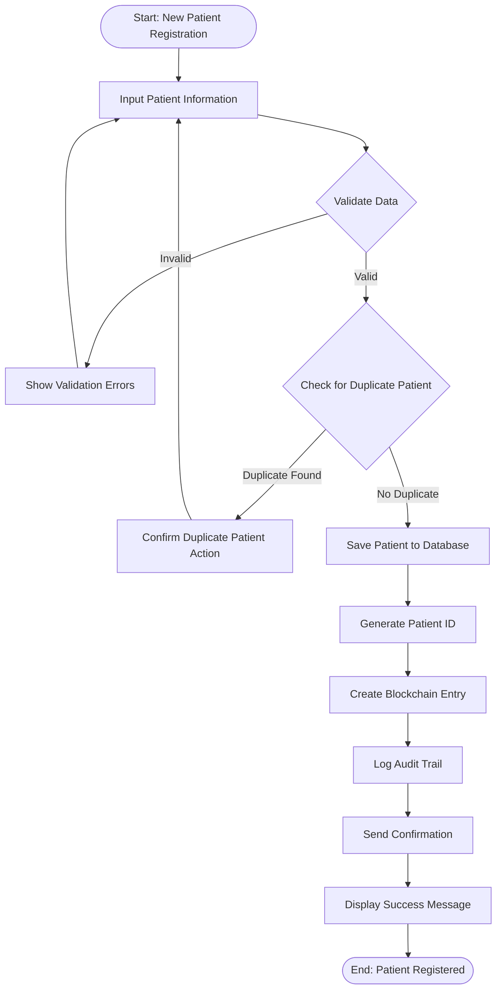

# UML Diagrams for Health Record Management System
## Architectural Views and Design Documentation

**Document Version:** 1.0  
**Date:** December 2024  
**System:** Administrative Health Record Management System  

---

## Table of Contents

1. [Use Case Diagrams](#use-case-diagrams)
2. [Class Diagrams](#class-diagrams)
3. [Sequence Diagrams](#sequence-diagrams)
4. [Component Diagrams](#component-diagrams)
5. [Deployment Diagrams](#deployment-diagrams)
6. [Activity Diagrams](#activity-diagrams)

---

## Use Case Diagrams

### System Overview Use Cases


### Detailed Use Case: Health Record Management


---

## Class Diagrams

### Core Domain Model

```mermaid
classDiagram
    class User {
        +int user_id
        +string username
        +string password_hash
        +string email
        +string first_name
        +string last_name
        +string role
        +boolean is_active
        +datetime created_at
        +authenticate(password) boolean
        +hasPermission(resource) boolean
        +getRole() string
    }
    
    class Patient {
        +int pat_id
        +string first_name
        +string last_name
        +date date_of_birth
        +string gender
        +string phone
        +string email
        +string address
        +string emergency_contact
        +datetime created_at
        +getAge() int
        +getFullName() string
        +updateContactInfo(info) void
    }
    
    class HealthRecord {
        +int record_id
        +int pat_id
        +int doctor_id
        +string diagnosis
        +string treatment
        +text notes
        +date record_date
        +datetime created_at
        +validate() boolean
        +generateSummary() string
        +logToBlockchain() boolean
    }
    
    class VitalSigns {
        +int vital_id
        +int pat_id
        +int nurse_id
        +float temperature
        +int blood_pressure_systolic
        +int blood_pressure_diastolic
        +int heart_rate
        +int respiratory_rate
        +float oxygen_saturation
        +datetime recorded_at
        +isNormal() boolean
        +getBloodPressure() string
        +flagAbnormal() boolean
    }
    
    class LabTest {
        +int test_id
        +int pat_id
        +int doctor_id
        +string test_type
        +string test_name
        +string status
        +string priority
        +date ordered_date
        +date sample_collected_date
        +date result_date
        +text results
        +text notes
        +datetime created_at
        +updateStatus(status) void
        +addResults(results) void
        +isOverdue() boolean
    }
    
    class Prescription {
        +int prescription_id
        +int pat_id
        +int doctor_id
        +string medication_name
        +string dosage
        +string frequency
        +string duration
        +text instructions
        +string status
        +date prescribed_date
        +datetime created_at
        +isActive() boolean
        +calculateEndDate() date
        +dispense() boolean
    }
    
    class AuditLog {
        +int log_id
        +int user_id
        +string action
        +string record_type
        +int record_id
        +int patient_id
        +string details
        +datetime created_at
        +validateAccess() boolean
        +generateReport() string
    }
    
    User ||--o{ HealthRecord : creates
    User ||--o{ LabTest : orders
    User ||--o{ Prescription : prescribes
    User ||--o{ VitalSigns : records
    
    Patient ||--o{ HealthRecord : has
    Patient ||--o{ VitalSigns : has
    Patient ||--o{ LabTest : undergoes
    Patient ||--o{ Prescription : receives
    
    HealthRecord ||--o{ AuditLog : logged_in
    LabTest ||--o{ AuditLog : logged_in
    Prescription ||--o{ AuditLog : logged_in
    VitalSigns ||--o{ AuditLog : logged_in
```

### Service Layer Architecture


---

## Sequence Diagrams

### Create Health Record Sequence


### Blockchain Validation Sequence


### Patient Record Access Sequence


---

## Component Diagrams

### System Component Overview


### Blockchain Component Detail


---

## Deployment Diagrams

### Kubernetes Deployment Architecture


### Network Architecture Deployment


---

## Activity Diagrams

### Patient Registration Workflow



### Health Record Creation Workflow


### Blockchain Validation Process


### Lab Test Management Workflow


---

## State Diagrams

### Health Record State Transitions


### Lab Test State Machine


---

## Summary

This comprehensive UML documentation provides multiple architectural views of the Health Record Management System:

### Key Architectural Views Covered:

1. **Use Case Diagrams**: System functionality and user interactions
2. **Class Diagrams**: Object-oriented design and relationships
3. **Sequence Diagrams**: Dynamic behavior and message flows
4. **Component Diagrams**: System structure and dependencies
5. **Deployment Diagrams**: Physical architecture and infrastructure
6. **Activity Diagrams**: Business process workflows
7. **State Diagrams**: Object lifecycle and state transitions

### Architecture Highlights:

- **Layered Architecture** with clear separation of concerns
- **Service-Oriented Design** for scalability and maintainability
- **Blockchain Integration** for audit trails and data integrity
- **Kubernetes Deployment** for high availability and scalability
- **Security-First Design** with multiple protection layers
- **HIPAA Compliance** through comprehensive audit trails

This documentation serves as a complete architectural reference for development, deployment, and maintenance of the Health Record Management System.
